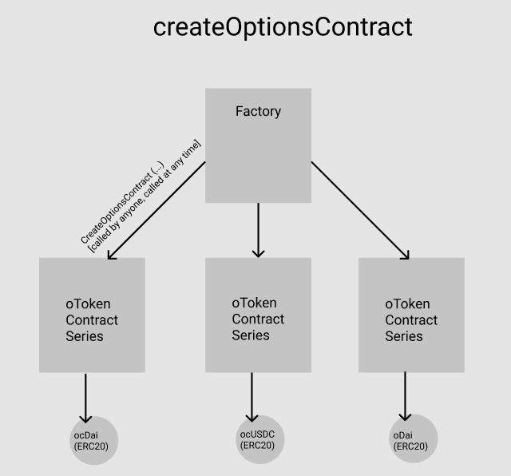

# Getting Started

## Introduction to Convexity

Convexity is a Decentralized Put Options Protocol built on the Ethereum Blockchain. Convexity provides an easy interface to buy and sell put options. 

Put options work as insurance in traditional finance. Convexity allows options sellers to earn premiums on their collateral and options buyers to protect themselves against technical, financial and systemic risks that various DeFi projects face. These risks include hacks, bank runs, a DeFi crisis etc. 

Please join the \#dev room in the Opyn community [Discord](https://discord.gg/ugAv3SH) server; our team, and members of the community, look forward to helping you build an application on top of Opyn. Your questions help us improve, so please don't hesitate to ask if you can't find what you are looking for here. 

## Resources

* [Website](http://www.opyn.co/)
* [Whitepaper](https://drive.google.com/file/d/1YsrGBUpZoPvFLtcwkEYkxNhogWCU772D/view)
* [Github](https://github.com/aparnakr/OptionsProtocol)
* Twitter
* Discord
* Email

### Additional Beginner Resources

* [Connect a JS app to a smart contract on the Ethereum Blockchain](https://medium.com/coinmonks/tutorial-how-to-connect-a-javascript-front-end-to-a-smart-contract-6af4bdf45f7a)
* [Web3](https://github.com/ethereum/wiki/wiki/JavaScript-API)
* Faucets for testnet ETH
  * Rinkeby
  * Goreili
  * Kovan
* Faucet for oTokens

## Networks 

 The Opyn Protocol is currently deployed on the following networks:

### Rinkeby

<table>
  <thead>
    <tr>
      <th style="text-align:left">Contract</th>
      <th style="text-align:left">JSON</th>
      <th style="text-align:left">
        
Solidity

        
Interface

      </th>
      <th style="text-align:left">Address</th>
    </tr>
  </thead>
  <tbody>
    <tr>
      <td style="text-align:left">Uniswap Exchange</td>
      <td style="text-align:left"><a href="https://docs.uniswap.io/smart-contract-integration/interface">JSON</a>
      </td>
      <td style="text-align:left"></td>
      <td style="text-align:left"></td>
    </tr>
    <tr>
      <td style="text-align:left">Uniswap Factory</td>
      <td style="text-align:left"><a href="https://docs.uniswap.io/smart-contract-integration/interface">JSON</a>
      </td>
      <td style="text-align:left"></td>
      <td style="text-align:left">0xf5D915570BC477f9B8D6C0E980aA81757A3AaC36</td>
    </tr>
    <tr>
      <td style="text-align:left">Options Exchange</td>
      <td style="text-align:left"><a href="https://github.com/aparnakr/OptionsProtocol/blob/buyer-and-seller-docs/ABIs/OptionsExchange.json">JSON</a>
      </td>
      <td style="text-align:left"></td>
      <td style="text-align:left"></td>
    </tr>
    <tr>
      <td style="text-align:left">Dai</td>
      <td style="text-align:left"></td>
      <td style="text-align:left"></td>
      <td style="text-align:left"></td>
    </tr>
    <tr>
      <td style="text-align:left">cDai</td>
      <td style="text-align:left"><a href="https://compound.finance/developers/abi/mainnet/cDAI">JSON</a>
      </td>
      <td style="text-align:left"></td>
      <td style="text-align:left"></td>
    </tr>
    <tr>
      <td style="text-align:left">cUSDC</td>
      <td style="text-align:left"><a href="https://compound.finance/developers/abi/mainnet/cUSDC">JSON</a>
      </td>
      <td style="text-align:left"></td>
      <td style="text-align:left"></td>
    </tr>
    <tr>
      <td style="text-align:left">ocDai</td>
      <td style="text-align:left"><a href="https://github.com/aparnakr/OptionsProtocol/blob/buyer-and-seller-docs/ABIs/oToken.json">JSON</a>
      </td>
      <td style="text-align:left"></td>
      <td style="text-align:left"></td>
    </tr>
    <tr>
      <td style="text-align:left">oDai</td>
      <td style="text-align:left"><a href="https://github.com/aparnakr/OptionsProtocol/blob/buyer-and-seller-docs/ABIs/oToken.json">JSON</a>
      </td>
      <td style="text-align:left"></td>
      <td style="text-align:left"></td>
    </tr>
    <tr>
      <td style="text-align:left">ocUSDC</td>
      <td style="text-align:left"><a href="https://github.com/aparnakr/OptionsProtocol/blob/buyer-and-seller-docs/ABIs/oToken.json">JSON</a>
      </td>
      <td style="text-align:left"></td>
      <td style="text-align:left"></td>
    </tr>
    <tr>
      <td style="text-align:left">Options Factory</td>
      <td style="text-align:left"><a href="https://github.com/aparnakr/OptionsProtocol/blob/buyer-and-seller-docs/ABIs/OptionsFactory.json">JSON</a>
      </td>
      <td style="text-align:left"></td>
      <td style="text-align:left"></td>
    </tr>
  </tbody>
</table>### Mainnet

## Smart Contract Architecture 

### Options Factory

The OptionsFactory contract is used to create and keep track of options marketplaces. Each options marketplace is a new instantiation of the oToken contract. 

### oToken

Every option supported by the Convexity Protocol is integrated through an oToken smart contract. Options sellers create options by locking up collateral for some period of time and minting oTokens. Each oToken protects a unit of the specified underlying asset. The Options seller can sell these oTokens on an exchange to earn premiums. The oToken marketplaces deployed for the purpose of insurance are oDai, ocDai and ocUSDC. 

## Example Use Case: Insurance on Compound

Consider the case of a Compound user who wants insurance on their Dai locked in Compound. They fear Compound getting hacked or having a bank run. The insurance buyer pays the insurance provider some premium ahead of time to get access to oTokens. An example of an oToken is the ocDai token which protects the holder of the token from Jan 1 2020 to Jan 1 2021 against any technical or financial risks that Compound's cDai faces. In the case of a disaster, the holder of the ocDai can turn in their oToken and their cDai and in exchange take the collateral locked in the Convexity Protocol by insurance providers. If there is no disaster, it is strictly worse for the holder of cDai to give up their cDai in exchange for collateral locked on the Convexity protocol. In such a case, the insurance providers keep their collateral and earn a premium on it. 

## Gas Costs 

## web3 version + solidity compiler version  

## Glossary of Terms 

| Term | Description |
| :--- | :--- |
| Put Option |  |
| Premium |  |
| Option Seller |  |
| Option Buyer |  |
| Underlying |  |
| Strike Asset |  |
| Strike Price |  |
| putsOutstanding |  |

